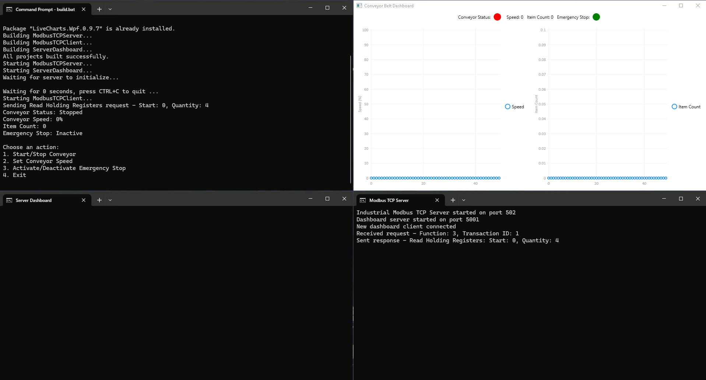

# Enhanced Modbus TCP Server and Client with Real-time Dashboard

This project provides a simple Modbus TCP server and client implementation in C# for Windows, featuring a real-time WPF dashboard for visualizing data.

## Features

- Modbus TCP Server simulating a conveyor belt system
- Modbus TCP Client for interacting with the server
- Real-time WPF dashboard displaying conveyor belt status and statistics
- Supports Read Holding Registers (0x03) and Write Single Register (0x06) functions
- Simulates temperature sensors, item counting, and emergency stop functionality

## Requirements

- Windows operating system
- .NET Framework 4.8
- Visual Studio 2019 or later (for development)

## Project Structure

- `ModbusTCPServer.cs`: Server implementation
- `ModbusTCPClient.cs`: Client implementation
- `ServerDashboard/`: WPF project for the real-time dashboard
- `build.bat`: Batch script to build and run all components

## Getting Started

1. Clone this repository
2. Ensure .NET Framework 4.8 is installed on your system
3. Open a command prompt in the project directory
4. Run `build.bat` to compile and start all components

## Demo

The demo GIF shows four windows:

1. **Top Left**: Terminal running `build.bat` and client interaction
2. **Top Right**: WPF Dashboard showing real-time conveyor belt data
3. **Bottom Left**: Server terminal output

## Usage

1. Run `build.bat` to start the server, client, and dashboard
2. Use the client terminal to interact with the simulated conveyor belt system:
   - Start/stop the conveyor
   - Adjust conveyor speed
   - Activate/deactivate emergency stop
3. Observe real-time updates on the WPF dashboard

## Customization

You can modify the server, client, or dashboard code to add more features or change the simulation behavior. After making changes, run `build.bat` again to recompile and run the updated system.

## Contributing

Contributions are welcome! Please feel free to submit a Pull Request.

## License

This project is licensed under the WTFPL (Do What The F\*ck You Want To Public License). See the [LICENSE](https://en.wikipedia.org/wiki/WTFPL) for details.

## Disclaimer

This implementation is intended for educational and demonstration purposes. It may not be suitable for production environments without further development and security considerations.
